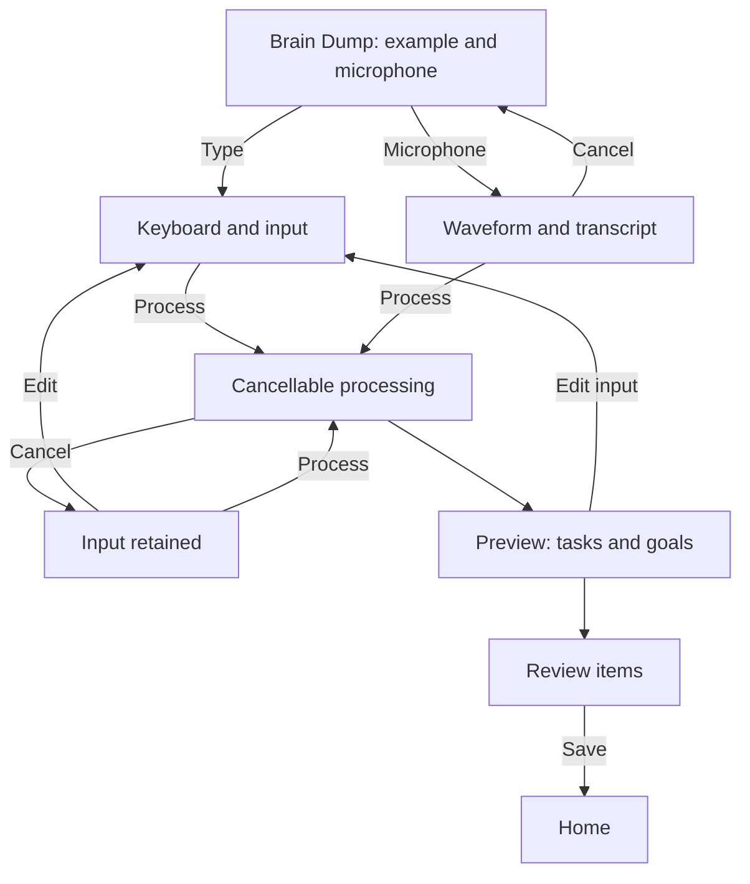

# Revision 3 — controls, alignment and capture

Design-only update on [Redesign 1 by AI](https://www.figma.com/design/v6VyKHrnxzBtkDuCl8nneS/defog?node-id=1095-368). Application implementation is unchanged.

## What changed

- Home uses one Apple two-symbol toolbar group. Home / Tasks / Goals share the main tab capsule; the waveform capture shortcut uses the native separate trailing bubble geometry.
- Task overflow is a borderless native symbol button. Schedule and goal pills align at the same x-coordinate as the title, inside a shared task-card master. Pill visuals are 30pt high within 44pt menu targets.
- Today uses peach, This Week lilac, Someday neutral; text preserves the distinction independently of color. Unlinked goals use a dashed outline; linked goals use sage. Counts have less trailing space.
- Goal detail uses a small green symbol in navigation and one large activity name. The large green introduction panel is removed. Generated goal examples are Read / Run / Guitar.
- Capture starts with example text and a microphone in a floating plain composer. Process appears with input. The processing state is cancellable and leads to Preview, then Review and Save. Typed and voice input both have paths through it.
- Voice uses the editable waveform and subtitle text without a Recording label or gradient panel. Cancel is a peach button; Process is the primary action.
- Content scrolls behind a short top fade and the floating bottom controls. The tab95 / home34 slots are unchanged. Three separate collapsed-title specimens demonstrate the intended navigation state.

## Review links

- [Empty capture](https://www.figma.com/proto/v6VyKHrnxzBtkDuCl8nneS/defog?node-id=1118-6207&starting-point-node-id=1118%3A6207)
- [Input ready to process](https://www.figma.com/proto/v6VyKHrnxzBtkDuCl8nneS/defog?node-id=1165-2970&starting-point-node-id=1165%3A2970)
- [Home](https://www.figma.com/proto/v6VyKHrnxzBtkDuCl8nneS/defog?node-id=1097-589&starting-point-node-id=1097%3A589)
- [Component refinements](https://www.figma.com/design/v6VyKHrnxzBtkDuCl8nneS/defog?node-id=1161-3068)

## Verification and limits

The structural check covers 32 screen/state frames, 360 navigation destinations/actions counted across reactions, and 50 task instances including hidden schedule slots and collapsed-title copies. It found no missing destinations or device/safe-area bound failures. Task-title and metadata x offsets both equal 68pt from the card's left edge.

Visual checks covered Home, Tasks, goal detail, empty capture, voice, processing, preview and review. Browser checks and final evidence are recorded in validation.json and verification.md.

Figma uses synthetic input, static voice graphics and a 1.6-second processing transition. It does not record speech or call an AI provider. The API has no scroll-position trigger, so tapping a large heading opens the collapsed-title specimen; tapping its small navigation title returns. This is a design demonstration, not native continuous title collapse. Context menus still use the existing prototype overlay placement. Dynamic Type, dark mode, arbitrary long text and production persistence need implementation-level validation after approval.

## Construction record

Scripts are ordered historical mutations, not an idempotent rebuild tool. Read live Figma state before reuse. Run through the Figma MCP only. `common.js` and the revision-2 masters/helpers are inputs as noted in each file. Response ledgers retain created and mutated node IDs. No credentials, worker event logs or simulator preference stores are included.

Free Muse Spark 1.3 / xhigh reviewed selected source files. The coordinator owns these Figma edits and visual checks. See worker-review.md for accepted findings and rejected assumptions.
