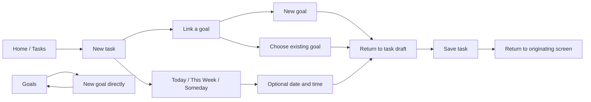

# Redesign Two by AI

1 October 2026. Design proposal; application implementation has not changed.

[Canvas](https://www.figma.com/design/v6VyKHrnxzBtkDuCl8nneS/defog?node-id=1226-4050) · [Main prototype](https://www.figma.com/proto/v6VyKHrnxzBtkDuCl8nneS/defog?node-id=1228-4471&starting-point-node-id=1228%3A4471&scaling=scale-down&content-scaling=fixed) · [Recovery scenarios](https://www.figma.com/proto/v6VyKHrnxzBtkDuCl8nneS/defog?node-id=1241-6783&starting-point-node-id=1241%3A6783&scaling=scale-down)

## Preservation and editing

The original Redesign 1 page `1095:368` is unchanged. All 82 top-level items were copied twice to page `1226:4050`. The left copy preserves the design; the working copy starts at x8160. Each copy has its own 48 local component masters and its own 66 copied prototype variables. Native Apple library instances and shared visual styles remain reused. Shared styles/tokens were not edited.

Figma page cloning converts singleton masters into instances, so the copy step explicitly rebuilt those masters and relinked the copies. Self-navigation inherited from the source was excluded when Figma rejected it. The working-copy audit found no instances linked to the original 48 masters and no prototype links into the original or preserved copy.

New form masters and blank owner alternatives sit at `1239:5903`, alongside the new manual-flow screens. Recovery components are at `1241:6517`. Screen examples use instances. The construction scripts are a historical execution record with recorded node IDs, not replay-safe migrations.

## Product direction

There are two entities: tasks/reminders and goals. The owner corrected an accidental reference to note-taking. Text recorded within a goal remains goal progress.

- Home and Tasks offer New task; Goals offers New goal.
- A task needs a title. Schedule and goal are optional choices with Today as the sample default.
- Today / This Week / Someday remain the visible groups. Date & time is a separate disclosure inside Schedule.
- Creating a goal from the task's goal picker returns to that task draft.
- Draft scheduling and saved task values are separate. Save publishes the draft; discard preserves the saved item.
- Task creation remembers whether it began on Home, Tasks or the goal detail.
- Brain Dump remains a separate persistent shortcut. It is not required for ordinary creation.
- Onboarding in this direction ends at everyday Home. This supersedes the earlier proposal to end onboarding in Brain Dump.

## Brain Dump states

Connection failure retains the input and offers retry or explicit basic processing. No results offers editing or manual creation. Interrupted voice retains the sample transcript. Microphone denial keeps typed input available. Cancel processing returns to the filled composer. Review supports task removal and goal removal; no selected items disables Save and offers restoring the preview or editing the input. Processing again resets review selection.

The scenario launcher is a design-review tool, outside the app UI. It selects simulated failure outcomes. No real provider call, dictation, notification or persistence occurs in the prototype.

## Scope and limitations

This is an initial exploration for owner review, not complete UX coverage. Figma uses one fixed manually-created task and goal. Tap the title field to fill the example. Native date/time accessories show a fixed sample; this pass does not emulate the full picker or keyboard. Save is idempotent for this fixture; real repeated-save handling still needs implementation tests.

Remaining work includes arbitrary titles, multiple new items, time zones, notification permission recovery, recurrence decisions, provider-specific failures, background interruption handling and durable drafts. The original Settings/tour limitations remain documented in Redesign 1. Native scroll-driven title collapse is still a development requirement, not a behavior proven by this prototype.

## Review and evidence

- Muse Spark 1.3 contributor free, `xhigh`, reviewed selected source/brief inputs and then the manual-flow script. Both successful calls reported $0; no paid worker fallback was used.
- `source-review.md` is scoped analysis. Its claim about no standalone goal picker is not accepted as a repository-wide fact: the snapshot omitted `TaskCardView`.
- `worker-review.md` caught draft/saved coupling, goal-link visibility and origin-return issues. The coordinator addressed these in `polish.js`. Removing a date now restores the prior group instead of blindly forcing Today.
- The worker suggestion to add prototype disclaimers inside product helper text was rejected. Prototype limitations belong on the canvas/documentation; the proposed product label explains the intended alert behavior.
- `evidence/` contains Figma renders. They are design evidence, not observed native-app behavior or measured improvement.
- See `verification.md` for the tested paths and remaining interaction limits.

No Swift files were changed, and no app build was necessary for this design/documentation milestone.
