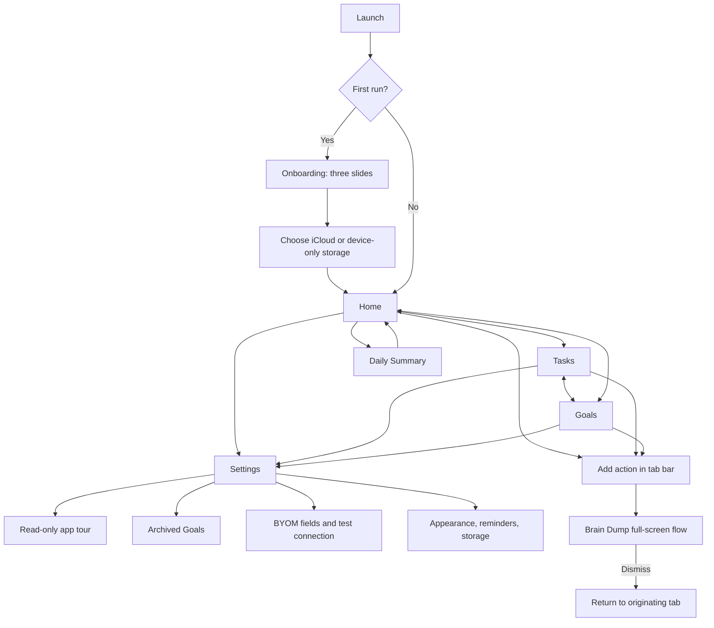
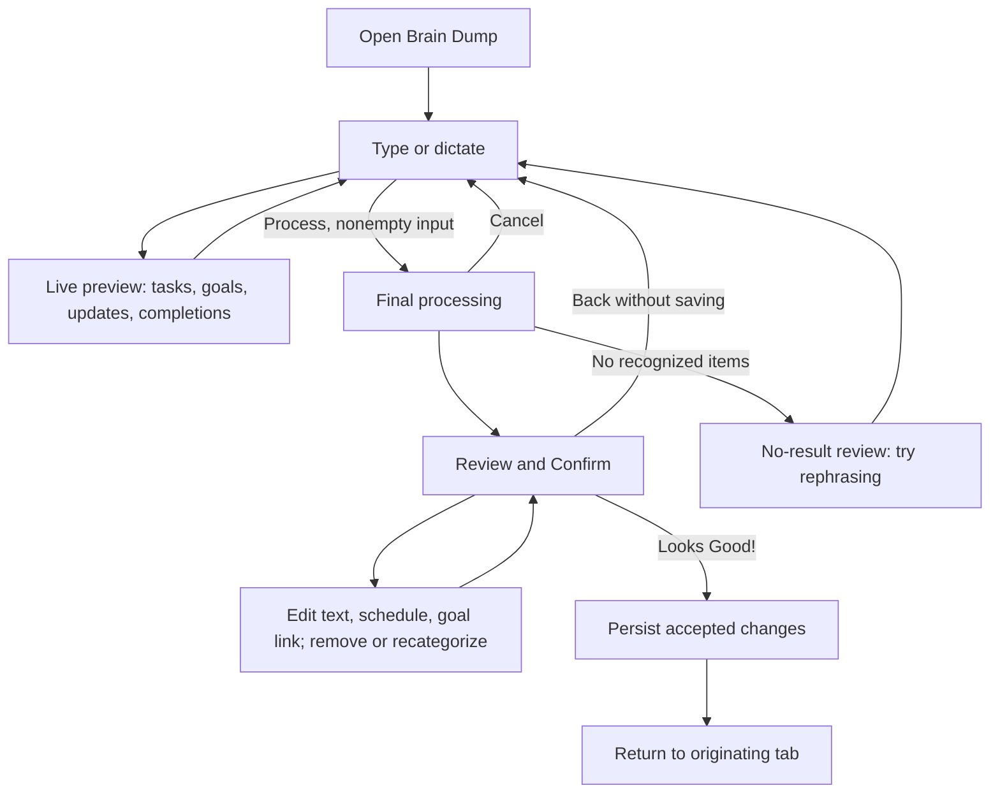
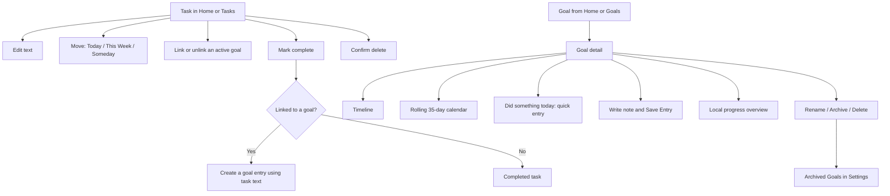

# Defog: current app, flows and structural wireframes

Neutral handoff for a new design agent. Extracted 29 September 2026 from the **app-as-Figma baseline**, page `967:1893` in [Defog](https://www.figma.com/design/v6VyKHrnxzBtkDuCl8nneS/defog?node-id=967-1893). Do not use the Components page or earlier redesign drafts as the visual brief.

## Reading this document

**F** means visible in the baseline Figma frame; **O** means covered by the synthetic simulator walkthrough; **S** means source-derived behavior. The Figma baseline has twelve phone frames and no wired navigation. Arrows below describe application behavior, supplemented by verified source; they are not extracted Figma interaction links. Wireframes preserve content hierarchy and controls, not exact pixels, colors or old styling.

The baseline is incomplete and contains translation artifacts. Its empty Brain Dump has a detached content frame; some bottom bounds differ from the agreed convention. Those are canvas issues, not proven app defects. Goal frame `984:436`, checked against capture 17, supersedes the earlier overlap claim. Do not reproduce translation errors.

## Product in one paragraph

Defog helps someone unload thoughts, then separate finite **tasks** from ongoing **goals**. Typed or spoken input produces a live interpretation; the person reviews it before saving. Tasks belong to Today, This Week or Someday and may link to a goal. Goals accumulate quick progress entries or written notes. The app can use local rules or a user-configured OpenAI-compatible model. There is no required account, social feed, team workspace, subscription flow or streak-reward economy in the current product.

## Main navigation and first run



F/O: tab destinations, Add affordance, Home toolbar, Settings and first onboarding slide. S: full onboarding sequence, storage gate, navigation semantics and lower Settings routes. Voice permission alerts were observed before onboarding; this is a timing problem, not a dependency of typed capture.

## Capture → interpretation → review → persistence



F/O: the synthetic path recognized “Buy groceries today”, “Call the dentist this week”, and “Learn guitar”; Review saved two tasks and one goal. S: completion detection, goal updates, drag between categories, cancel and no-result branches. **Live preview is not persisted data.** Saving occurs on the final confirmation action.

Processing mode (S): no API key uses local rules; a configured model is called for interpretation. Current request failures fall back to local rules, with inconsistent visibility between live and final processing. Do not imply that a remote request succeeded or silently carry this weakness into a proposal.

## Tasks and goal progress



F: task controls, goal timeline and quick-action row. O: schedule menu and quick logging. S: edit/delete/link behavior, calendar, detailed note and lifecycle edge cases. Current reopening a task leaves its generated goal entry behind; archiving a goal unlinks tasks. A new proposal must specify these consequences instead of inventing clean undo semantics.

## Baseline screen inventory

| ID | Screen | Evidence | Entry and important exit |
|---|---|---|---|
| B01 `974:237` | Home empty | F/O | Tab; Add opens capture |
| B02 `984:87` | Home populated | F/O | Tab; goal detail, More tasks, summary, settings |
| B03 `984:163` | Tasks | F/O | Tab or More tasks; task actions |
| B04 `984:242` | Goals | F/S | Tab; tap a goal |
| B05 `984:296` | Brain Dump empty | F/O, canvas artifact | Add; dismiss or compose |
| B06 `984:330` | Brain Dump live preview | F/O | Compose; Process |
| B07 `984:383` | Review & Confirm | F/O | Processing; Back or Looks Good! |
| B08 `984:436` | Goal detail | F/O | Goal card; Back or progress actions |
| B09 `984:492` | Daily Summary | F/O (capture 19) | Home toolbar; close |
| B10 `984:521` | Settings, upper viewport | F/O | Toolbar; close, app tour, model test |
| B11 `984:570` | Archived Goals empty | F/O | Settings; Back |
| B12 `984:591` | Onboarding, first slide | F/O | First launch; Skip or Next |

Missing as dedicated baseline frames: storage choice, processing, calendar, note editor, menus/alerts, most errors, later onboarding slides, lower Settings and many empty states. Source-derived descriptions are supplied where needed; a later agent should not claim these were observed in Figma.

## Basic structural wireframes

Square brackets denote controls; parentheses denote content or state. Every phone has a native status region and home indicator. Tabbed screens also have Home / Tasks / Goals and the current Add action. The map intentionally omits decorative shapes and color decisions.

```text
B01–02 HOME                         B03 TASKS
 [Daily summary] [Settings]           [Settings]
 Home                                Tasks
 Active Goals                        Today
 (empty message OR goal cards)        (task rows OR empty message)
 Today's Tasks                       This Week
 (empty message OR up to 3 rows)      (task rows OR empty message)
 [More tasks when needed]             Someday
                                     [Completed, collapsible — S]
 [Home | Tasks | Goals] [+]           [Home | Tasks | Goals] [+]

B04 GOALS                           B08 GOAL DETAIL
 [Settings]                          [Back] Goal name + color [More]
 Goals                               [Timeline | Calendar]
 (goal rows: name, entries, streak)   (date + quick entry / written note)
 (OR empty target + explanation)     (OR rolling 35-day grid — S)
                                     [Local overview, shown as sparkle]
                                     [Did something today] [Add note]
 [Home | Tasks | Goals] [+]           [Home | Tasks | Goals] [+]

B05–06 BRAIN DUMP                   B07 REVIEW & CONFIRM
 [Back/dismiss]                       [Back]
 Brain Dump                          Review & Confirm
 Tell me everything on your mind     (editing instructions)
 (live interpretation, scrollable)   These look like tasks
   Tasks / Goals / Updates / Done     (text, schedule, goal link, remove)
 (permission warning when denied)    New goals
 [Multiline editor]                  (name, color, remove)
 [Mic] [Process]                      (updates/completions when present)
 [Keyboard Done when applicable]     [Looks Good!]

B09 DAILY SUMMARY                  B10 SETTINGS
 [Close]                             [Back/close] Settings
 Daily Summary                       App tour; Version
 Completed tasks today               Appearance: [Dark Mode]
 Goal progress today                 BYOM: endpoint / key / model
 (today entries per goal)            [Test BYOM connection]
 (encouragement OR empty sun)        (connection result / helper)
                                     Reminders / Storage / Archive — S

B11 ARCHIVED GOALS                 B12 ONBOARDING
 [Back] Archived Goals               (illustrative symbol)
 No archived goals.                  Clear your mind
 (OR rows with Unarchive — S)        (short explanation)
                                     (3-page indicator)
                                     [Skip] [Next]
```

Additional source-only wireframes: Processing = Cancel + spinner + factual processing-path label; note editor = title + multiline entry + Cancel/Save; storage choice = iCloud/device-only + unavailable alert; daily prompt = stale-task count + Move to This Week / Keep in Today / Not now.

## Constraints for a fresh design

Keep task vs goal semantics, optional goal linking, three schedule buckets, deliberate review before saving, local/BYOM choice, and quick/written progress. Change hierarchy, visual treatment, wording and presentation as needed. Strong SF Pro Rounded titles/headings/buttons are an owner preference. Use actual native Apple instances whenever a matching component exists.

Do not inherit old visual composition or canvas bugs. Do not invent user-research findings, improvement metrics, account features, model-generated progress analysis, or verified privacy/sync guarantees. Separate proposed behavior from what works now. Implementation still requires owner approval.

## Sources and next-agent entry point

- [Product facts](../product.md), [source screen inventory](../screen-inventory.md), [audit](../ux-audit.md), [simulator evidence](../evidence/2026-09-28/README.md).
- Primary source: `defog iOS/Views/MainTabView.swift`, `Views/BrainDump/BrainDumpView.swift`, `Views/BrainDump/ConfirmationView.swift`, `Views/Tasks/TaskCardView.swift`, `Views/Goals/GoalDetailView.swift`, `Views/SettingsView.swift` under the same native app directory.
- [Fresh-design agent brief](redesign-1-ai.md); [standalone main-flow Mermaid](current-app-flow.mmd).
